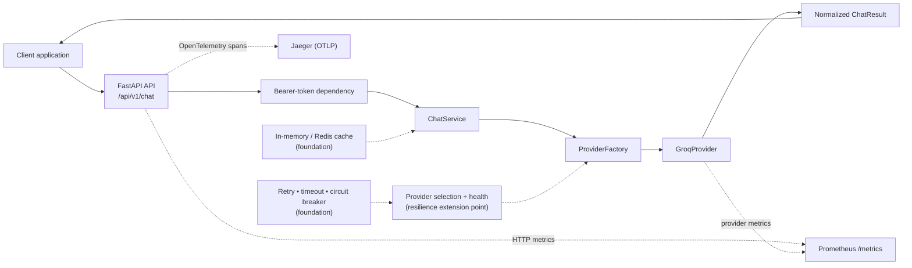

# Self-Healing LLM Gateway

> An extensible, observable API gateway for routing application traffic to LLM providers while keeping provider SDKs, resilience policies, and platform concerns outside the core application flow.

## Why this project exists

LLM applications should not need to know which vendor SDK to call, how to normalize provider responses, or how to observe provider failures. This project explores the platform layer between a client application and multiple model providers: one stable API, one provider contract, and clear boundaries for reliability, security, and operations.

The project is intentionally more than a chat wrapper. Its design separates provider integration, routing policy, load balancing, caching, rate protection, telemetry, authentication foundations, and deployment concerns so that each can evolve without coupling the HTTP API to a vendor implementation.

## What is implemented today

| Area | Current state | What it does |
| --- | --- | --- |
| HTTP gateway | **Implemented** | Async FastAPI application with versioned chat routes, validation, health probes, metrics, CORS, and OpenAPI documentation. |
| Provider boundary | **Implemented** | `LLMProvider` abstracts provider SDKs and returns a normalized `ChatResult`; Groq is the provider selected by the running request path. |
| Gemini adapter | **Implemented adapter; validation gap** | A Gemini adapter is present behind the provider contract. A fresh install still needs `google-genai` declared in the project dependencies before that adapter can be executed. |
| Provider telemetry | **Implemented and wired** | Provider request/failure counters and latency histograms are emitted by provider adapters; HTTP request metrics are captured by middleware and exposed at `/metrics`. |
| Tracing | **Integrated** | FastAPI is instrumented with OpenTelemetry and exports spans over OTLP/gRPC. Docker Compose supplies Jaeger as the local trace backend. |
| Local observability stack | **Implemented** | Compose starts Redis, Prometheus, Grafana, and Jaeger alongside the gateway. Prometheus is configured to scrape the gateway every five seconds. |
| Resilience primitives | **Implemented foundations** | Retry/backoff, timeout, circuit-breaker state, provider health, fallback, and selection components are covered by tests but are not yet composed into the production `/api/v1/chat` path. |
| Security/platform primitives | **Implemented foundations** | API-key, RBAC, OAuth-shaped token, HMAC signing, audit, secrets, and token-bucket abstractions are isolated from business logic. The public chat route currently uses a lightweight bearer-token check, not standards-compliant JWT/OIDC validation. |
| Deployment automation | **Implemented baseline** | Multi-stage Docker build, Compose topology, GitHub Actions quality gates, and Kubernetes Deployment/Service/Ingress/HPA manifests are included. |

This distinction is deliberate: the repository demonstrates both a working provider gateway and the composable platform primitives required to evolve it safely. It does not claim that every primitive is already active in every request.

## Architecture



### Current request path

The active `POST /api/v1/chat` route validates a prompt, requires a bearer token, creates a `ChatService`, and uses `ProviderFactory` to create a `GroqProvider`. The Groq adapter calls the Groq async SDK and translates the response to the domain-level `ChatResult` entity. This keeps routers and application services free of Groq response shapes.

`POST /api/v1/chat/stream` returns `text/event-stream`. At present it generates the complete provider response first and then streams that response to the client; it is an HTTP streaming interface, not upstream token-by-token provider streaming yet.

### Layering and dependency direction

| Layer | Responsibility | Representative modules |
| --- | --- | --- |
| API | HTTP contracts, dependency injection, routing, response serialization | `app/api`, `app/schemas`, `app/middleware` |
| Application | Use-case coordination, commands, provider policy and pipeline building blocks | `app/application` |
| Domain | Provider contract and provider-neutral result entity | `app/domain` |
| Core | Cross-cutting policies: settings, resilience, logging, security foundations, rate limiting | `app/core` |
| Infrastructure | Provider SDK adapters, cache adapters, registries, telemetry, tracing, Prometheus metrics | `app/infrastructure` |
| Bootstrap | Alternative composition root for structured logging, request context, and exception handlers | `app/bootstrap` |

The central port is [`LLMProvider`](app/domain/providers/provider.py). Adding a provider means implementing its async `chat(prompt)` contract and normalizing its response into [`ChatResult`](app/domain/entities/chat_result.py), instead of leaking vendor-specific types into routers or services.

## Provider and routing design

### Provider abstraction

The provider contract deliberately has a small surface area:

```python
class LLMProvider(ABC):
    @abstractmethod
    async def chat(self, prompt: str) -> ChatResult: ...
```

Current adapters:

- **Groq** — active in the current factory-backed runtime path; emits provider request, failure, and latency telemetry.
- **Gemini** — adapter source is present and returns the same domain entity. Before using it from a clean environment, add and lock the `google-genai` dependency.

### Selection and traffic-distribution foundations

Provider selection and load balancing are intentionally separate:

- `ProviderSelector` and `SmartProviderSelector` decide which provider is eligible or preferred based on health, capability, latency metrics, configured weights, cost scores, and historical success rate.
- `RoundRobinLoadBalancer` distributes traffic across eligible providers and can skip providers marked unhealthy.
- `CapabilityRegistry`, `ProviderCosts`, `ProviderWeights`, `ProviderHistoryRegistry`, sticky-provider assignments, and fallback-chain models make routing policy configurable and testable.

These classes are tested building blocks, not a claim that the active chat endpoint already performs cost-aware, multi-provider live routing. The current factory selects Groq directly; composing these components into the application bootstrap is the next integration step.

## Reliability engineering foundations

The project contains the core mechanics needed for a self-healing provider layer:

| Mechanism | Behavior | Runtime status |
| --- | --- | --- |
| Retry executor | Bounded async retry with exponential backoff (`max_attempts=3`, 0.5s initial delay, 8s cap) | Foundation; not yet wrapped around the live provider call |
| Timeout executor | Runs an awaitable under an explicit timeout policy (30 seconds by default) | Foundation; not yet wired into the route |
| Circuit breaker | Closed → open after configurable failures; transitions to half-open after recovery timeout | Foundation; registry is not yet invoked by the active endpoint |
| Health monitor | Tracks health state, failures, latency, and last-check timestamp per provider | Used by selector components; health checks are not yet provider probes |
| Failover pipeline | `ChatPipeline` can select a fallback provider after a provider exception | Unit-tested; the live endpoint uses `ChatService` directly |
| Cache abstractions | TTL-aware in-memory cache and a Redis adapter | Available but not injected into the active chat route |

The guiding failure model is to make dependency failure visible, bounded, and measurable: reject work when a circuit is open, avoid unbounded retries, route only to compatible healthy providers, and emit telemetry for every provider attempt.

## Observability

The gateway is designed so a provider interaction can be followed through metrics, traces, and structured application context.

### Metrics

`GET /metrics` exposes Prometheus-format metrics. The running application records:

- `http_requests_total` and `http_request_duration_seconds`, labeled by method, path, and status where applicable.
- `provider_requests_total`, `provider_failures_total`, and `provider_latency_seconds`, labeled by provider.

Prometheus is configured to scrape `gateway:8000/metrics` every five seconds. Grafana is included as the visualization layer and persists its state in the `grafana_data` volume. No dashboard definitions are committed yet, so dashboards must be provisioned or created separately.

### Tracing and logs

FastAPI is instrumented with OpenTelemetry. The tracer exports through OTLP/gRPC to `OTEL_EXPORTER_OTLP_ENDPOINT` (Jaeger in Compose). The repository also contains a structured JSON logging pipeline with request and correlation IDs plus recursive masking for common sensitive fields. That richer logging/request-context middleware is composed in `app/bootstrap/application.py`; `app/main.py` currently composes tracing, CORS, and metrics directly.

## Security boundaries

Security concerns are kept outside provider implementations and business use cases.

- **Request validation:** Pydantic accepts prompts from 1 to 10,000 characters.
- **Chat-route authentication:** `HTTPBearer` plus `JWTManager.verify_token()` protects chat endpoints. The current manager only checks a lightweight token shape; it is suitable as an interface seam, not production JWT signature/issuer/audience validation.
- **API-key manager:** in-memory key registration, validation, and revocation abstraction; not attached to current routes and not durable across replicas.
- **RBAC, OAuth service, request signing, audit logger, secret manager:** isolated foundations with unit tests. They require a production identity store, durable audit sink, configured signing secret, and standards-compliant OIDC/JWT validation before enterprise use.
- **CORS:** configured permissively (`*`) in the current runtime. Restrict allowed origins before exposing the gateway publicly.

## API reference

Interactive OpenAPI documentation is available when the service is running at `http://localhost:8000/docs`.

| Endpoint | Purpose |
| --- | --- |
| `GET /` | Service identity and running status |
| `GET /health` | Health probe |
| `GET /ready` | Readiness probe |
| `GET /live` | Liveness probe |
| `GET /metrics` | Prometheus scrape endpoint |
| `POST /api/v1/chat` | Authenticated chat completion |
| `POST /api/v1/chat/stream` | Authenticated `text/event-stream` response |

Example request for local development (the current token verifier accepts a non-empty value after `:`):

```bash
curl --request POST http://localhost:8000/api/v1/chat \
  --header 'Content-Type: application/json' \
  --header 'Authorization: Bearer local:development-token' \
  --data '{"prompt":"Explain why provider abstraction matters."}'
```

Example response:

```json
{
  "id": "chat_<generated-id>",
  "response": "...",
  "provider": "groq",
  "model": "llama-3.3-70b-versatile",
  "created_at": "2026-08-08T00:00:00+00:00"
}
```

## Run locally

### Prerequisites

- Python 3.13+
- [uv](https://docs.astral.sh/uv/)
- A Groq API key for real chat requests
- Docker and Docker Compose for the complete local platform stack

The settings module requires both `GROQ_API_KEY` and `GEMINI_API_KEY` at import time, even though Groq is the currently selected runtime provider. Set both locally; a placeholder Gemini value is sufficient while only exercising Groq.

```bash
export GROQ_API_KEY='your-groq-key'
export GEMINI_API_KEY='placeholder-until-gemini-is-enabled'

uv sync --frozen --extra dev
uv run uvicorn app.main:app --reload --host 0.0.0.0 --port 8000
```

Then visit `http://localhost:8000/docs` or call the health endpoint:

```bash
curl http://localhost:8000/health
```

### Run the complete local stack

```bash
export GROQ_API_KEY='your-groq-key'
export GEMINI_API_KEY='your-gemini-key'
docker compose up --build
```

| Service | URL / port | Purpose |
| --- | --- | --- |
| Gateway | `http://localhost:8000` | API, docs, health, and metrics |
| Redis | `localhost:6379` | Shared cache infrastructure |
| Prometheus | `http://localhost:9090` | Metrics collection and querying |
| Grafana | `http://localhost:3000` | Metrics visualization; persistent volume enabled |
| Jaeger | `http://localhost:16686` | Trace UI |
| OTLP gRPC | `localhost:4317` | Trace ingestion |
| OTLP HTTP | `localhost:4318` | Trace ingestion |

## Deployment and scaling posture

The repository includes Kubernetes manifests for a two-replica deployment, ClusterIP service, ingress, ConfigMap/Secret references, resource requests and limits, HTTP health probes, and an HPA configured for 2–10 replicas at 70% average CPU utilization.

This is a useful horizontal-scaling baseline, but application-level state must move behind shared infrastructure before treating the gateway as fully multi-replica. In particular, in-memory API keys, rate-limit buckets, provider health, routing history, circuit state, sticky assignments, and audit events are process-local today. Redis is present in Compose and has a cache adapter, providing a natural path for cache and distributed-control-plane state; it is not yet the active store for all of those concerns.

## Quality gates

The project uses Python 3.13, strict MyPy configuration, Ruff, Black, Pytest with branch coverage, pre-commit, and GitHub Actions.

```bash
export GROQ_API_KEY=test-groq-key
export GEMINI_API_KEY=test-gemini-key

uv run --extra dev ruff check .
uv run --extra dev ruff format --check .
uv run --extra dev mypy app
uv run --extra dev pytest
pre-commit run --all-files
```

Verified against the repository revision documented here:

- **158 tests passed**
- **84% total branch-aware coverage**
- **Ruff check passed**
- **Ruff format check passed**
- **MyPy passed with no errors**

The test suite covers domain contracts, routing and selection primitives, failover behavior, resilience policies, cache adapters, rate limits, security foundations, telemetry registration, and deployment/CI configuration. Provider SDK network paths and some middleware/bootstrap branches remain intentionally outside unit-test coverage.

## Engineering roadmap

The next production-hardening steps follow directly from the current architecture rather than requiring a redesign:

1. Compose the provider registry, smart selector, retry, timeout, circuit breaker, health monitor, and cache into one live request pipeline.
2. Declare and lock the Gemini SDK dependency, then add adapter-level integration tests against controlled mocks or a sandbox environment.
3. Replace lightweight token validation with OIDC/JWT verification (issuer, audience, signature, expiry, and key rotation) and connect RBAC to authenticated identities.
4. Move process-local operational state to Redis or another durable/shared control plane for horizontally scaled behavior.
5. Add real upstream token streaming, provider-specific error classification, and bounded failover observability.
6. Restrict production CORS, externalize secrets to a managed secret store, and persist audit events to a durable sink.
7. Provision Grafana dashboards and alert rules as code; add load, failure-injection, and end-to-end provider tests.

## Documentation

The high-level design material is kept under [`docs/hld`](docs/hld):

- [System architecture](docs/hld/SYSTEM_ARCHITECTURE.md)
- [System components](docs/hld/SYSTEM_COMPONENTS.md)
- [Functional requirements](docs/hld/FUNCTIONAL_REQUIREMENTS.md)
- [Non-functional requirements](docs/hld/NON_FUNCTIONAL_REQUIREMENTS.md)

## Technology stack

| Category | Technologies |
| --- | --- |
| Language and API | Python 3.13, FastAPI, Pydantic, Uvicorn |
| LLM integration | Groq async SDK; Gemini adapter boundary |
| Observability | Prometheus, OpenTelemetry, OTLP/gRPC, Jaeger, Grafana, Structlog |
| Platform | Docker, Docker Compose, Redis, Kubernetes manifests |
| Quality | Pytest, pytest-asyncio, pytest-cov, Ruff, Black, MyPy, pre-commit, GitHub Actions |
| Dependency management | uv and a committed `uv.lock` |

## License

This repository is currently marked **Proprietary** in `pyproject.toml`.
